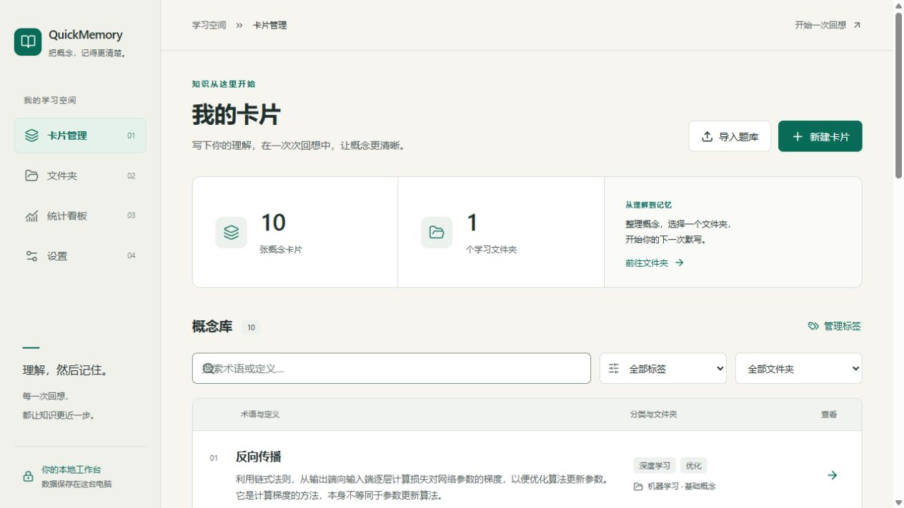

# 轻记 · QuickMemory

本机、单人使用的概念默写工具。你编写参考定义，按文件夹随机默写，再查看多位 AI 裁判的反馈、历次分数与错误类型统计。**参考定义是唯一评分标准，模型的额外知识提示不计分。**

后端使用 Python / FastAPI / SQLAlchemy / SQLite，前端使用 React / Vite / TypeScript。没有登录、部署或云同步；网页资源完全在本地，只有主动核对、评分和连接测试会请求你配置的 LLM 接口。



## Windows 一键启动

1. 打开 [GitHub Releases](https://github.com/healther3/QuickMemory/releases/latest)，推荐下载 Windows ZIP 并解压，内含 `QuickMemory.exe` 和许可说明；也提供独立 EXE。GitHub 自动生成的源码压缩包不包含可执行程序。
2. 将 EXE 放在一个可写的独立文件夹中，双击启动。无需安装 Python 或 Node.js，也不需要命令行；稍等几秒会打开独立的轻记窗口。需要 Microsoft Edge WebView2 Runtime（多数 Windows 电脑已安装）；缺失时按提示安装 [微软官方运行时](https://developer.microsoft.com/microsoft-edge/webview2/)。
3. 在“设置”中填写自己的模型服务商、API 密钥和模型名称，即可使用 AI 核对与评分。

默认以独立桌面窗口运行，不会打开外部浏览器。关闭窗口或点击 **设置 → 应用运行 → 退出轻记** 会同时停止后台；最小化时继续运行。重复双击会唤起已有窗口，未保存的卡片编辑会在关闭前提示。程序不会自行注册 Windows 开机启动。

需要原浏览器模式时使用 `QuickMemory.exe --browser`，该模式保留系统托盘和网页关闭服务入口，关闭浏览器标签页不会停止后台。源码入口 `run.py` 仍使用浏览器。

在 **设置 → 应用运行** 中可查看本地服务地址，并修改首选端口（1024–65535）。点击“保存端口”后，关闭服务并重新双击 EXE，新端口才生效；端口被占用时会尝试附近可用端口，页面显示实际地址。端口保存在 `data/launcher.json`，源码入口也读取同一配置；命令行 `--port` 仅覆盖当次启动。浏览器模式的托盘菜单也提供“服务设置（端口与关闭）”入口。

可用 PowerShell 的 `Get-FileHash .\QuickMemory.exe -Algorithm SHA256` 与 Release 附带的 SHA256 摘要核对下载文件。

题库、历史和模型设置继续保存在 **EXE 同级的 `data` 文件夹**。更新时退出轻记、替换 EXE 即可，保留 `data`；移动到其他文件夹或电脑时，将 EXE 和 `data` 一起移动。单独复制 EXE 会在新位置创建全新题库。EXE 本身不含你的数据库或 API Key，日志位于同级 `logs`，窗口缓存和答题草稿位于同级 `webview`。

Microsoft Store 上架准备见 [Windows 商店发布说明](docs/WINDOWS_STORE.md)。仓库提供 MSIX 构建脚本；目前生成的开发身份包未签名、未提交商店，不能当作正式安装包。商店版的数据将存放在当前用户的 `LocalState/data`，与便携版目录独立。

## 从源码首次安装

需要 Python 3.11+ 和 Node.js 22.12+。克隆仓库后安装依赖并构建前端；仓库不包含 `.venv`、`node_modules` 或生产构建。

```powershell
git clone https://github.com/healther3/QuickMemory.git
cd QuickMemory
python -m venv .venv
.\.venv\Scripts\python.exe -m pip install -r requirements.txt
npm --prefix frontend ci
npm --prefix frontend run build
.\.venv\Scripts\python.exe run.py
```

如果 Windows 的 Python 命令是 `py`，创建环境使用 `py -3 -m venv .venv`。macOS / Linux 使用 `python3` 创建环境，将 `.\.venv\Scripts\python.exe` 替换为 `.venv/bin/python`。Windows 可执行发行包仅适用于 Windows，其他平台使用源码入口。在 Windows 已安装依赖并构建前端后，也可运行 `.venv\Scripts\python.exe desktop.py` 测试独立窗口。

首次安装依赖需要网络，运行时不自动安装依赖。锁定的 Python 依赖记录在 `requirements-lock.txt`，前端锁定在 `frontend/package-lock.json`。

完成安装后，Windows 日常可双击 **`启动轻记.cmd`**，或运行 `python run.py`。启动器会优先使用项目 `.venv`，启动本机服务并自动打开 `http://localhost:8000`。端口占用时自动选择附近端口；Ctrl+C 关闭。启动器对数据库加实例锁，避免重复启动产生重复评分任务。已有 `node_modules` 但缺少 `dist` 时会自动构建。

```powershell
python run.py --port 8080         # 本次使用 8080，不修改已保存的端口
python run.py --no-browser        # 不自动打开浏览器
python run.py --build             # 重新构建前端后启动
python run.py --dev               # 同时运行 Vite + FastAPI，自动配置本地代理
```

## 使用流程

1. **设置模型**：选择 DeepSeek、Gemini、OpenAI、Kimi、通义千问或自定义兼容接口；填写你的 API 密钥和模型名称，保存并测试连接。预设模型只是可编辑建议，实际可用性取决于你的服务商账户。
2. **准备题库**：首次空库会加入一个包含 10 张机器学习示例卡片的文件夹。你可以编辑、删除，也可新建卡片或导入 JSON。一个卡片可属于多个文件夹，用户标签与评分错误类型分别管理。
3. **可选 AI 核对**：在编辑页点击 AI 核对，只核对当前输入，不自动保存核对结果或采用改写。界面显示“AI 核对结果不一定正确，请自行复查”。
4. **开始默写**：从文件夹开始考试，全部卡片随机排序。每题记录耗时，没有时间限制。提交后立即继续，评分在后台进行。浏览器保存未提交草稿，可从最近考试继续。
5. **查看结果**：结果自动更新。查看正确率、完整度、三个反馈部分、裁判原始分数与分歧，以及独立的“模型提示（不计分，仅供参考）”。可以修改错误标签或对失败评分重试。
6. **只重考错题**：全部评分任务结束后，创建仅包含低于本场及格线的题目的新考试。未评分不会被当作零分或错题。重考沿用原题快照，新场使用当前评分参数。
7. **统计与历史**：按文件夹、用户标签筛选错误类型分布；查看按平均分升序的卡片及每张卡片的历史答案、平均分、最低分、最近已评分分数与平均耗时。

没有配置密钥时仍可管理卡片、导入导出及作答；评分会明确显示“未评分”，不会生成虚构分数。模型调用会使用服务商额度。

## 导入与导出

打开“导入题库”，选择 UTF-8 JSON 文件（支持 BOM）或粘贴 JSON，选择已有/新建文件夹。默认新文件夹名来自文件名。支持：

```json
{"过拟合":"训练集表现好，但在新数据上泛化差。","Dropout":"训练时随机置零部分神经元输出。"}
```

```json
[{"term":"过拟合","definition":"训练集表现好，但在新数据上泛化差。","tags":["泛化"],"reference_note":"可选教材摘录"}]
```

先预览新增、跳过、覆盖与无效条目，再确认。重复以目标文件夹内修剪后的术语进行大小写不敏感比较，默认跳过。覆盖只更新定义，保留原有其他信息；共享卡片的其他文件夹会同时看到更新，预览会提示。空术语/定义等无效行会给出原因。单次最多 10000 条，JSON 文本最多 1000 万字符。

预览后内容或目标发生变化会要求重新预览；令牌在 30 分钟后或应用重启后失效。导入不会触发 AI 核对。文件夹可导出同样的数组对象格式；完整示例见 `examples/ml_terms.json`。

## 评分与历史的边界

- 默认同一模型 3 位裁判并行，各自输出正确率/完整度；仅成功裁判参与平均，默认权重各 0.5。
- 额外一次 LLM 请求合并文字，不能修改数字。每次 JSON 校验失败仅重试一次。合并失败时采用第一位成功裁判的三个部分，保留所有成功裁判的模型提示。
- 全部裁判失败，分数为 `null`、状态为 `failed`。正确率、完整度或加权分的极差任一大于 20 时显示分歧提示。
- 后台最多并行处理 2 道题；退出或异常中止后，已提交但仍待评分的记录将在下次启动恢复，可能再次消耗模型额度。
- 考试保存术语、定义、题序及评分参数快照，之后修改/删除卡片不改变旧试卷。未提交题目的参考定义不会出现在考试响应中。
- 同一场考试使用当时的模型和参数。更换服务商或地址后，旧场次重新评分需要恢复对应提供商/地址和密钥；密钥本身不复制到历史。
- 错误类型可新增、重命名、删除，并可在已评分答案上手动修改。模型知识提示不会用于错误类型统计。
- 整体统计包含已删除卡片的历史作答；文件夹/标签筛选按卡片当前归属统计，不把多重归属重复计数。未评分不参与平均分和最低分。

数值聚合和数据隔离由代码保证；模型是否严格遵循参考定义与简体中文提示仍取决于模型输出质量，不能把 AI 反馈当作已核实事实。

## 数据、密钥与备份

默认数据库为源码项目或 EXE 所在目录下的 `data/quickmemory.db`，与启动时的工作目录无关。可设置 `QUICKMEMORY_DB` 指向另一个 SQLite 文件。卡片、设置和历史均保存在本机；**API 密钥以明文保存在本地 SQLite**，API 读取只返回 `has_api_key`。切换提供商/地址且未提供新密钥时会清除旧密钥，避免误发。请勿公开数据库、日志或含真实凭证的配置；提交问题时使用脱敏信息。

文件夹导出用于题库备份，不包含完整历史/设置。完整备份请先关闭应用，然后复制 `data` 目录。示例卡片只在首次空库初始化，删除后不会自动补回。新增加的 `app_meta` 表只存初始化标记及错误类型 ID 序列，既有表不重置。

LiteLLM 禁用远程模型目录、外部分词下载和第三方日志回调；所有服务商通过其 OpenAI 兼容接口访问。默认 JSON 模式为 `auto`，明确不支持时才回退到提示词 + Pydantic 校验；可在设置切换为强制或关闭。

## 开发与验证

```powershell
.\.venv\Scripts\python.exe -m pip install -r requirements-dev.txt
.\.venv\Scripts\python.exe -m pytest -q
npm --prefix frontend test
npm --prefix frontend run build
.\.venv\Scripts\python.exe scripts/export_openapi.py
npm --prefix frontend run types:api
```

`python run.py --dev` 提供 Vite 热更新及 `/api` 代理。也可分开运行：

```powershell
.\.venv\Scripts\python.exe -m uvicorn backend.main:app --host 127.0.0.1 --port 8000 --reload
npm --prefix frontend run dev
```

完整 API 路由见 [docs/API_CONTRACT.md](docs/API_CONTRACT.md)，生成的机器契约为 [docs/openapi.json](docs/openapi.json)；运行中可访问 `/openapi.json`。为避免访问 CDN，默认 Swagger/ReDoc 页面关闭。

已通过后端测试、前端交互测试、TypeScript 检查、生产构建和 Windows 冻结程序自检。自动化评分测试使用模拟 LLM，不消耗真实额度；尚未验证真实服务商连通性及真实评分语义质量。具体已执行验证与限制见 [docs/VALIDATION.md](docs/VALIDATION.md)。自行验证真实模型可使用：

```powershell
.\.venv\Scripts\python.exe -m backend.cli.configure --provider deepseek --prompt-key --save
.\.venv\Scripts\python.exe -m backend.cli.grade_sample --sample examples/sample_answer.json
```

`--save-result` 可将 CLI 结果保存在考试历史。环境变量 `QUICKMEMORY_API_KEY` 仅作为 CLI 当前调用的凭证；没有显式 `configure --save` 不写入数据库。

## 重新打包 Windows EXE

需要在 Windows 开发环境构建；使用应用的人不需要这些构建依赖。

```powershell
.\.venv\Scripts\python.exe -m pip install -r requirements-build.txt
.\.venv\Scripts\python.exe scripts/build_windows.py
```

构建生成 `dist/QuickMemory.exe`，并复制为根目录 `轻记.exe`。配方只打包代码、运行库、网页资源、图标和示例题库。原业务数据库、密钥、日志和测试数据不进入包。构建日志为 `build/windows-build.log`；版本摘要和 SHA256 在 `dist/release.json`。已有最新网页构建时可添加 `--skip-frontend`。

发行包提供独立离线自检：`轻记.exe --self-test 报告.json`，使用内存数据库和本机模拟接口检查冻结环境中的 LiteLLM、SQLite、资源和评分流程。开发验收脚本 `scripts/smoke_windows.py` 会使用独立 `.qa` 数据库检查重复启动、持久化、静态页和退出；`--tray` 同时启动实际 Windows 托盘，`--desktop` 验证真实 WebView2 窗口加载、重复唤起、端口保存重启和退出。独立窗口需要允许 WebView2 子进程正常运行的桌面环境。

## 项目结构与上下文

```text
backend/              模型、API、持久化、提示词、LLM 与后台评分
frontend/             React 页面、组件、样式、生成的 API 类型、Vite 配置
examples/             10 张示例卡片与单题评分样例
tests/                模拟 LLM 的后端、导入、考试、统计与集成测试
scripts/              OpenAPI 导出、Windows 构建与发行验收
design-system/        ui-ux-pro-max 设计规范与研究记录
docs/                 原始需求、API 契约、阶段记录与验证
run.py                本地一键启动及开发模式
desktop.py            无控制台桌面入口、本机服务与重复启动处理
desktop_window.py     WebView2 独立窗口与生命周期
desktop_tray.py       Windows 托盘图标和退出菜单
QuickMemory.spec      独立 EXE 构建配方
启动轻记.cmd          Windows 双击入口
```

原始产品说明见 [docs/PRODUCT_CONTEXT.md](docs/PRODUCT_CONTEXT.md)，核心行为约定见 [docs/CORE_CONTRACT.md](docs/CORE_CONTRACT.md)，实现记录见 [docs/PHASES.md](docs/PHASES.md)。界面依据 `ui-ux-pro-max` 的 [设计规范](design-system/quickmemory/MASTER.md)。

LLM 接入参考：[LiteLLM JSON 模式](https://docs.litellm.ai/docs/completion/json_mode)、[OpenAI 兼容接口](https://docs.litellm.ai/docs/providers/openai_compatible)、[本地模型目录](https://docs.litellm.ai/docs/proxy/custom_model_cost_map)。

## 贡献与许可

欢迎通过 [Issues](https://github.com/healther3/QuickMemory/issues) 报告问题或提出建议。提交修改前请阅读 [贡献指南](CONTRIBUTING.md)。项目使用 [MIT License](LICENSE)；第三方依赖仍遵循各自许可，见[第三方许可说明](THIRD_PARTY_NOTICES.md)。
